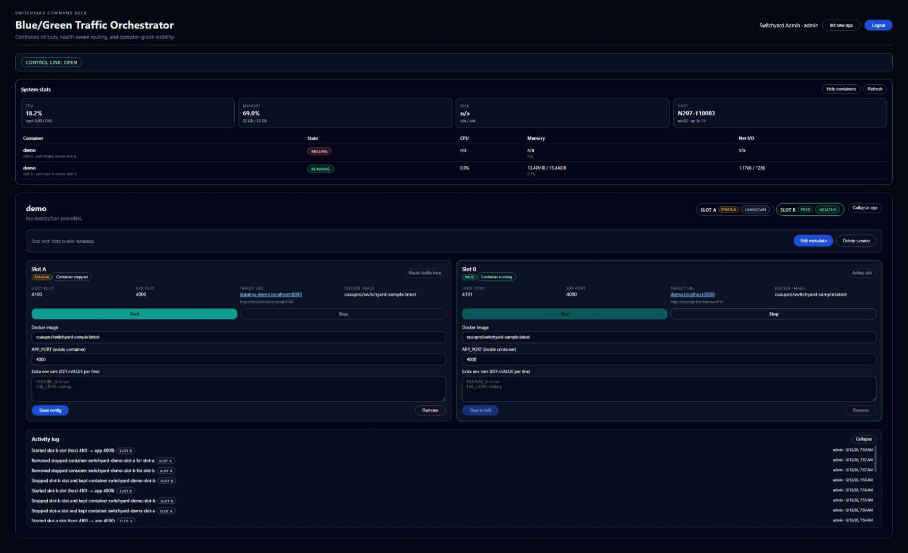

# Switchyard

Switchyard is a blue/green deployment control plane for containerized services.
It combines:
- a backend API (Node.js + Express + Prisma)
- a frontend console (Angular)
- Caddy-based traffic routing across two slots (`slot-a`, `slot-b`)



## What It Does
- Registers one managed service with two deployment slots.
- Starts/stops slot containers via Docker CLI.
- Routes live traffic to the active slot.
- Exposes a stable public host and per-slot hosts.
- Streams runtime updates to the UI over WebSockets.

## Routing Model
For a service named `sample-api` and domain `switchyard.localhost`:
- `sample-api.switchyard.localhost` -> active slot
- `slot-a.sample-api.switchyard.localhost` -> Slot A
- `slot-b.sample-api.switchyard.localhost` -> Slot B
- `staging.sample-api.switchyard.localhost` -> non-active slot

## Quick Start (Prebuilt Images)
Use this path when you want to run Switchyard without local Node builds.

1. Create a workspace and pull deployment artifacts.
```bash
mkdir switchyard && cd switchyard
curl -LO https://raw.githubusercontent.com/CuAuPro/switchyard/master/docker-compose.yml
curl -LO https://raw.githubusercontent.com/CuAuPro/switchyard/master/.env.example
mkdir -p scripts caddy
curl -L https://raw.githubusercontent.com/CuAuPro/switchyard/master/scripts/init.sh -o scripts/init.sh
curl -L https://raw.githubusercontent.com/CuAuPro/switchyard/master/caddy/Caddyfile.template -o caddy/Caddyfile.template
chmod +x scripts/init.sh
cp .env.example .env
cp caddy/Caddyfile.template caddy/Caddyfile
```

2. Prepare env file.
```bash
# edit .env values for your environment (JWT_SECRET, ADMIN_EMAIL/ADMIN_PASSWORD, ROUTER_DOMAIN, image tags, etc.)
# edit caddy/Caddyfile if you want custom TLS cert paths
# Optional for generated routes: set CADDY_TLS_CERT_FILE and CADDY_TLS_KEY_FILE in .env
```

`caddy/Caddyfile` is local-only (gitignored). Commit shared defaults in `caddy/Caddyfile.template`.

3. Initialize database + seed + router.
```bash
# Linux/macOS
./scripts/init.sh

# Windows PowerShell
powershell -ExecutionPolicy Bypass -File .\scripts\init.ps1
```

4. Start stack.
```bash
docker compose up -d
```

5. Open console.
- Production compose default: `http://console.switchyard.localhost:9000`
- Dev compose default: `http://console.switchyard.localhost:8080`

Default credentials:
- `ADMIN_EMAIL` from `.env` (default: `admin@switchyard.dev`)
- `ADMIN_PASSWORD` from `.env` (default: `Switchyard!123`)

## Local Development
For full local development (build/test/edit backend + frontend), use:

```bash
./scripts/init-local.sh
```

This script installs dependencies, runs migrations, seeds data, ensures Docker network setup, starts Caddy (dev compose), and pushes the generated router config.

For prebuilt production images, run `scripts/init.sh` first; it runs `prisma migrate deploy` before seed/router push.

## Compose Files
- `docker-compose.yml`
  - Uses prebuilt backend/frontend images
  - Exposes Caddy on `9000` (HTTP), `443` (HTTPS), `2019` (admin)
- `docker-compose.dev.yml`
  - Builds local backend/frontend Dockerfiles
  - Exposes Caddy on `8080` (HTTP), `8443` (HTTPS), `2019` (admin)

## Build and Publish Images
```bash
# backend
docker build -t cuaupro/switchyard-backend:latest ./backend

# frontend
docker build -t cuaupro/switchyard-frontend:latest ./frontend

# optional sample app
docker build -t cuaupro/switchyard-sample:latest ./sample-app
```

Push:
```bash
docker push cuaupro/switchyard-backend:latest
docker push cuaupro/switchyard-frontend:latest
```

Set `BACKEND_IMAGE` and `FRONTEND_IMAGE` in `.env`, then restart compose.

## Project Docs
- Backend internals and API details: `backend/README.md`
- Frontend architecture and workflows: `frontend/README.md`
